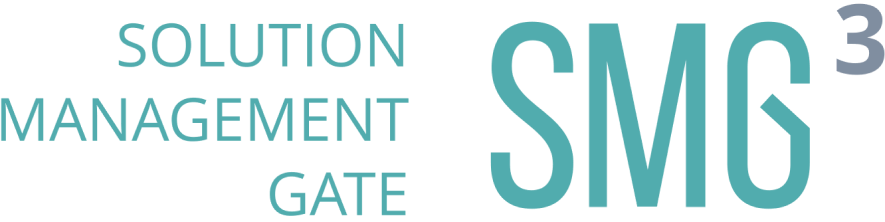

 

  

 

  

 

  <h2>U5.JS Solution Management Gate</h2>

SMG Mock API - staging API server for SMG Project. Built on top of Spring & Hibernate, typed with love by Kotlin. 

API Endpoint: [Heroku](https://smg-api-staging.herokuapp.com)

## Requirements
- JDK 11.x.x
- Intellij IDEA Ultimate 2021.x.x or higher (maybe could be lower)
- PostgreSQL 13

## Useful scripts
    ./gradlew build // Build project
    ./gradlew test // Run tests
    ./gradlew clean // Clean project

##Environment
App uses environment variables for flexibility & security. You could add this variables to .env (look .env.example) file or directly to your environment variables.

## API Gateway 
App uses api versioning notation. Your request address should look like this: {SERVER_ADDRESS}/api/v{API_VERSION}/{ROUTE}. Current API version: 1.
  
## Contributing
Create a PR using [this](docs/pull_request_template.md) template, wait for approvals from other devs & checkers, if all is fine - you're ready to merge!

## Links
- [Bitbucket Jira](https://itechart-smg.atlassian.net) - Jira page with project tasks
- [Bitbucket Confluence](https://itechart-smg.atlassian.net/wiki/spaces/SMG/pages/65785/SMG+App+Architecture) - Documentation pages
- [Bitrise Android](https://app.bitrise.io/app/f005ca26c0884ad6#/builds) - Bitrise CI/CD Android project
- [Bitrise iOS](https://app.bitrise.io/app/39af897e63f33a72#/builds ) - Bitrise CI/CD iOS project
- [Codacy](https://app.codacy.com/gh/TheLonelyAstronaut/ITA-SMG-App/dashboard?branch=dev) - Codecheck project
- [App](https://github.com/TheLonelyAstronaut/ITA-SMG-App) - Kotlin Multiplatform Mobile App
- [Proxy](https://github.com/TheLonelyAstronaut/ITA-SMG-Proxy) - Proxy for SMG API
- [Design](https://www.figma.com/file/eEsJ0WJqG5xRczdYtMr7BG/iTA-SMG-Mobile) - Figma project (Work in Progress)
